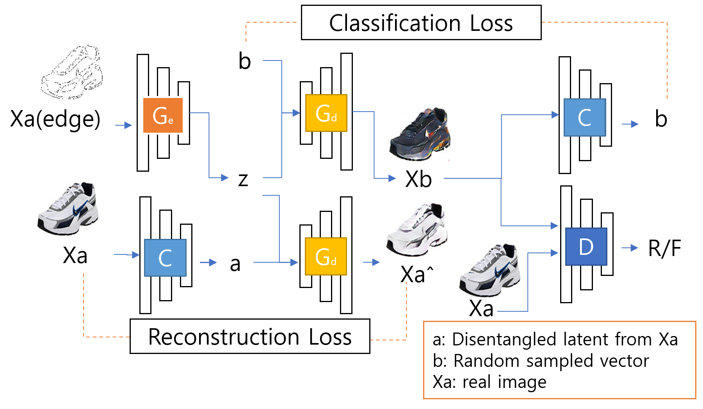
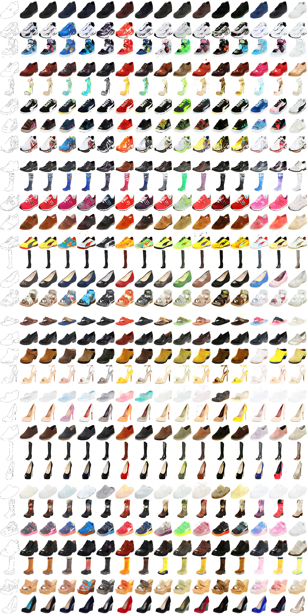

# BicycleAttGAN
- Combine BicycleGAN(idea of using latent classifier as style encoder) and AttGAN
- Way to translate input image with disentangled latent input
- Most code brought from [AttGAN](https://github.com/LynnHo/AttGAN-Tensorflow) and [EigenGAN](https://github.com/LynnHo/EigenGAN-Tensorflow)     


# Model structure
    


# Result   
- epoch 160 trained model output (img size 128, z_dims 13)
- first col / second col / remian col    
- ori source img / ori target img / output results when set value 4 to each input latent
    


# Run    
- bicycleAttGAN.ipynb


## Setup (brought from EigenGAN)
- Environment

    - Python 3.6

    - TensorFlow 1.15

    - OpenCV, scikit-image, tqdm, oyaml

    - *we recommend [Anaconda](https://www.anaconda.com/distribution/#download-section) or [Miniconda](https://docs.conda.io/en/latest/miniconda.html#linux-installers), then you can create the environment with commands below*

        ```console
        conda create -n EigenGAN python=3.6

        source activate EigenGAN

        conda install opencv scikit-image tqdm tensorflow-gpu=1.15

        conda install -c conda-forge oyaml
        ```

    - *NOTICE: if you create a new conda environment, remember to activate it before any other command*

        ```console
        source activate EigenGAN
        ```


# TODO
- ResNet
- Vae
- random z input
- tune hyperparameter 
- test quality using Fréchet Inception Distance
- test diversity using [lpips](https://github.com/richzhang/PerceptualSimilarity)

# Acknowledgement and References  
- [AttGAN](https://github.com/LynnHo/AttGAN-Tensorflow)     
- [EigenGAN](https://github.com/LynnHo/EigenGAN-Tensorflow)     
- [BicycleGAN](https://github.com/junyanz/BicycleGAN)
- [BicycleGAN-Tensorflow](https://github.com/clvrai/BicycleGAN-Tensorflow)
- [Bidirectional-InfoGAN](https://github.com/tohinz/Bidirectional-InfoGAN)
- [lpips](https://github.com/richzhang/PerceptualSimilarity)
